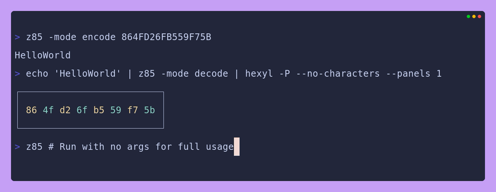

# z85
This repository provides a package and CLI for working with [Z85](https://rfc.zeromq.org/spec/32/).

> Z85 [is] a format for representing binary data as printable text. Z85 is a derivative of existing Ascii85 encoding mechanisms, modified for better usability, particularly for use in source code.

## Installation
Get a pre-built binary from the latest [Release](https://github.com/braheezy/z85/releases) page.

Or install with Go:

```bash
go install github.com/braheezy/z85@latest
```

## Usage
Use the `z85` tool to work encode binary to Z85 string format, or vice-versa. Supports pipes:



## Library
To use the library, import it and run `go mod tidy` to have it installed automatically:

```go
// main.go
package main

import z85 "github.com/braheezy/z85/pkg"

func main() {
    inputData := []byte{0x86, 0x4F, 0xD2, 0x6F, 0xB5, 0x59, 0xF7, 0x5B}
    encodedString, _ := z85.Encode(inputData)
    println(encodedString)
}
```
```console
> go mod tidy
> go run main.go
HelloWorld
```

Full decode and encode examples can be found in [main.go](./main.go).
